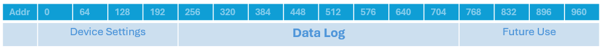

# ESP32-Data-Log
Log custom data in persistent memory.  
Used to log sensor data for diagnosing a problem in case of a crash, or for saving settings while keeping past settings as fallback.  
This Library is written for and tested on ESP32 (Espressif) and BW16 (AmebaD).  

## Installation
Download or Clone this repository and pull the folder into your Arduino libraries folder or use the 'Add .ZIP Libraries' function in the ArduinoIDE.  

## Using the Log

### 1 - Describe the data to be logged
```c
struct Entry{
    int timestamp;
    int sensor1;
    int sensor2;
};
```

### 2 - Create a Log
```c
DataLog<Entry> log;
``` 

### 3 - Add an Entry
```c
Entry newentry = {time(NULL), analogRead(GPIO_NUM_4), 25};
log.addEntry(&newentry); 
```
The log adds the entry to the persistent memory and remembers all entries even after a reset. If the log is full the oldest entry will be overwritten.

### 4 - Read an Entry 
```c
Entry readentry;
log.readEntry(-1, &readentry);
```
With 0 being the oldest entry, -1 the newest entry.

### 5 - Full Program
```c
#include <DataLog.h>

struct Entry{
    int timestamp;
    int sensor1;
    int sensor2;
};

void setup(){
    Serial.begin(115200);
    pinMode(GPIO_NUM_4, INPUT);

    DataLog<Entry> log;

    Entry readentry;
    if(log.readEntry(-1, &readentry) != -1){
        Serial.println("Logged Sensor Value: "+String(readentry.sensor1));
    }

    Entry newentry = {time(NULL), analogRead(GPIO_NUM_4), 25};
    log.addEntry(&newentry);

    delay(10000);
    ESP.restart();
}

void loop(){}
```
(For other microcontrollers see examples)

##  If EEPROM is also used by another Library

Go into <b>DataLog.h</b> and edit the following Macros
```c
//Change to Full Size of EEPROM in use
//If EEPROM range is used but not covered by this number it will be erased
#define EEPROM_MAX_SIZE 2048

//Change to start and end of where the data log should be.
//Memory outside this area is not touched by the library
#define LOG_START_ADDRESS 0
#define LOG_END_ADDRESS EEPROM_MAX_SIZE
```
### Example
For EEPROM memory with this intended layout:  

  
  
Change Macros to these numbers:  
```c
#define EEPROM_MAX_SIZE 1024
#define LOG_START_ADDRESS 256
#define LOG_END_ADDRESS 768
```
